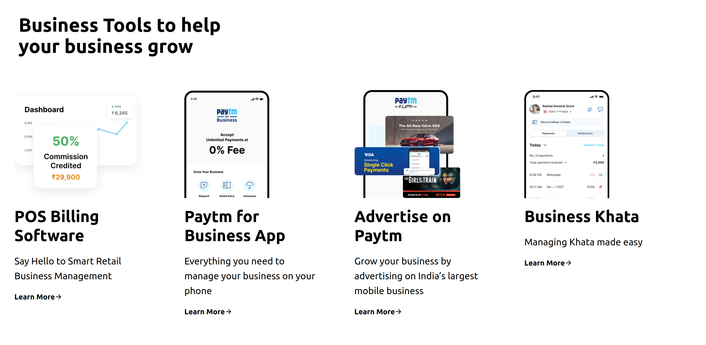
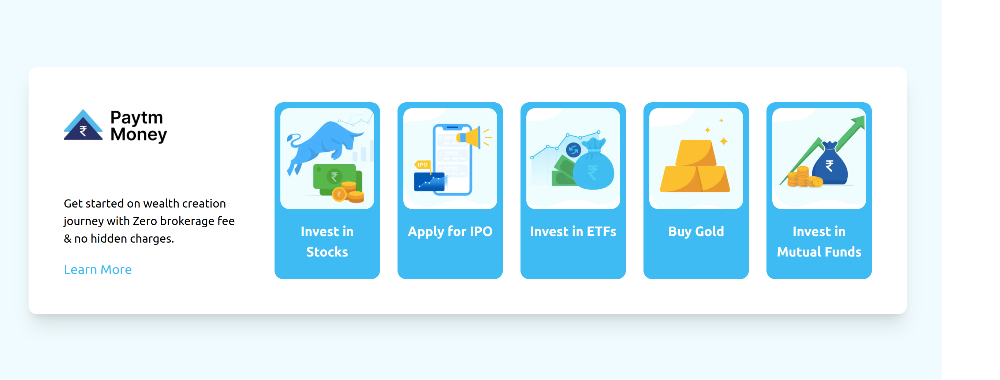
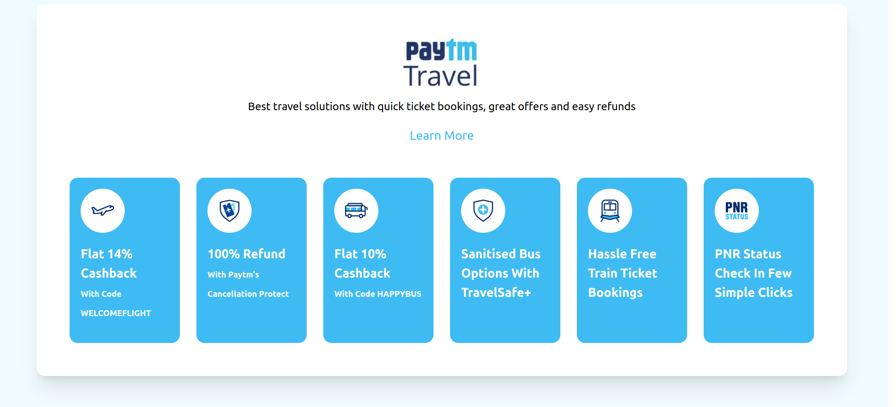
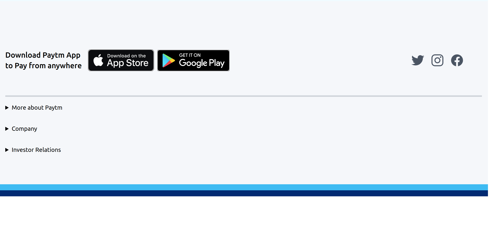
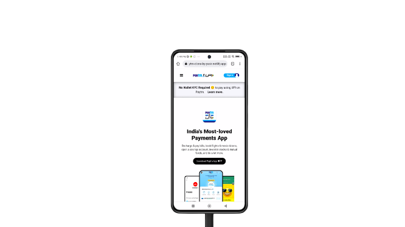

# Paytm Clone-With Tailwind

- This is my first project made with Tailwind CSS. I have made Paytm clone only using Tailwind CSS. It is mobile responsive and i have added some hovering effects to it. I learned a lot about Tailwind by making this site.

- It took me 1 day to complete this project, as it was my first time using tailwind it was quite hard but was an amazing experience.

  

---

## Breakpoints

- I have taken **Three** breakpoints to make it responsive.

  - sm = **1024px**
  - md = **768px**
  - lg = **480px**

---

## ScreenshotS

- Desktop View

- Mobile View

  

---

## 🛠 Skills learned

HTML, CSS, TO MAKE RESPONSIVE SITE, TAILWIND

---

## 🚀 About Me

### Hey, I am Yasir lambawala

- I am born and brought up in Vadodara, Gujarat. I have done my Btech at GTU university and I am currently learning Web-development.

---

## Feedback

- If you have any feedback, please reach me at lambawalay@gmail.com
